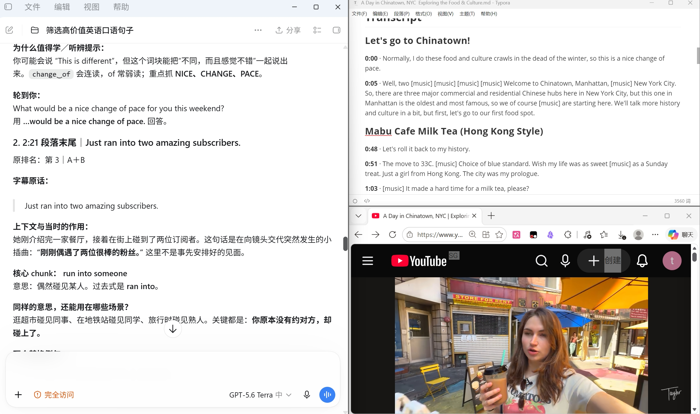

# 英语口语词块激活｜English Speaking Chunks

一个用于 Codex 的个人学习 skill：从带时间戳的英语视频字幕里，找出**看得懂、却未必听得出或主动说得出**的自然表达，再把它们变成可以在日常对话中使用的口语词块。

这套方法来自我的真实学习场景：IELTS 总分约 6、口语约 5；阅读时认识不少词，但听视频时反应慢，自己说话时也想不到这些组合。目标不是积累难词，而是激活已经认识的英语。

## 学习效果与我的窗口布局

我通常同时打开三个窗口：

1. **Codex**：阅读筛选结果、语境讲解、听辨提示和开口练习问题。
2. **带时间戳的视频原文字幕**：通过 Obsidian 插件获取，保存为 Markdown；截图中用文本编辑器查看，方便定位和对照原句。
3. **YouTube 原视频**：跳回对应时间，听真实语速，观察说话时的场景。

第一张效果图：左侧是 Codex 的讲解，右上是字幕，右下是原视频。



第二张效果图：同一次学习中的窗口布局。两张原始截图显示的是同一个画面，仍按原样保留，方便查看。


在自己造句时，我还会用**手机打开豆包的通话模式**，请它围绕当前视频话题实时用英语聊天。我会主动把刚学的词块放进回答里，让练习从“能看懂例句”走向“聊天时能自己说出来”。豆包是我个人的口语练习搭配，使用这个 skill 本身不需要豆包。

## 这个 skill 会做什么

- 先读完整份字幕，再选出最有学习价值的 **15–20 句**，按学习价值排序。
- 优先选择约 5–15 个词、常见词组成、口语自然、能迁移到其他日常场景的句子。
- 区分 **A 类：看得懂但可能听不懂**，以及 **B 类：听得懂但自己不容易主动说**；同一句可以兼具两种价值。
- 每句提取一个值得反复使用的核心 chunk，而不是讲一串孤立单词。
- 解释前后发生了什么、说话者为什么在这里说这句话，以及同样的意思还可以在哪些生活场景中使用。
- 给出简单中文意思、两个自然的替换例句、听辨提示，以及一个要求自己使用该词块回答的问题。
- 支持分批学习。指定“原清单第 1–6 句”或“继续第 7–10 句”时，保留原排名；如果按视频时间展示，也会标明原排名，避免编号混淆。

筛选会避开主要难在生僻词、专业术语或专有名词的句子，也会避开疑似转写错误。

## 一次学习怎么进行

1. 选一段自己愿意反复听的英语视频，用 Obsidian 插件取得**带时间戳字幕**，保存为 Markdown。也可以直接粘贴字幕。
2. 将字幕交给 Codex，调用 `$english-speaking-chunks`。先拿到全片的学习清单，再分批学习，避免一次消化太多。
3. 对每句先看字幕和上下文，理解它在当时起什么作用，再看核心 chunk 和可迁移场景。
4. 回到原视频的对应位置，先不看字幕听几遍；之后对照字幕检查连读、弱读、缩读或重音。字幕时间戳可能只是段落起点，需要在附近寻找原句。
5. 遮住例句，回答 Codex 给出的“轮到你”问题，讲自己的真实经历。必要时换人称或时态，不要只复述原句。
6. 用手机的豆包通话模式，围绕视频话题继续英语聊天，有意识地再次用到当天的词块。

听辨提示如果只依据字幕，会标为**常见口语读法的预测**，不会冒充对原视频音频的逐字核验。

## 如何安装与调用

将本仓库作为名为 `english-speaking-chunks` 的文件夹，放进你的 Codex skills 目录，保持 `SKILL.md` 在该文件夹根目录。常见位置是：

```text
~/.codex/skills/english-speaking-chunks/
├── SKILL.md
└── agents/
    └── openai.yaml
```

`assets/` 中的图片只用于本 README 展示；实际使用 skill 时，关键文件是 `SKILL.md`。安装后，在 Codex 对话中点名 `$english-speaking-chunks` 即可。若当前会话尚未显示新 skill，开启新会话后再调用。

首次分析新视频可以这样说：

> 请用 $english-speaking-chunks 分析这份带时间戳的字幕。先从全片筛选最值得学习的 15–20 句，按学习价值建立原排名；然后把原排名前 6 句按视频时间顺序详细讲解。每句都说明上下文、当时的表达作用、可以迁移到哪些日常场景，并给我两个替换例句和一个必须使用核心 chunk 回答的问题。

学完一批后可以继续说：

> 我学完了。请继续原清单的第 7–10 句，按视频时间顺序展示，并保留原排名。每句沿用上次的详细格式。

如果希望一次看完整清单，也可以直接要求“15–20 句全部详细讲解”；如果想慢慢学，则指定每批数量。分段粘贴长字幕时，在最后一段写“字幕发完了”，让 Codex 知道可以开始全片筛选。

## 一个实际例子

视频里说话者在街上碰到了两位订阅者，说：

> Just ran into two amazing subscribers.

值得练习的不是 *subscribers* 这个词，而是 **run into someone**：没有事先约好，却偶然碰见某人。它也适用于“在超市碰到老朋友”“在地铁站碰到同学”。练习时可以回答：**Who did you last run into, and where?** 然后尝试说出自己的句子，例如：*I ran into an old friend at the supermarket.*

这个例子展示了本 skill 的核心学习路线：**原句 → 当时的作用 → 可迁移的词块 → 自己的真实回答 → 对话中再次使用**。

## 文件说明

| 文件 | 用途 |
| --- | --- |
| [`SKILL.md`](SKILL.md) | 筛选标准、讲解格式、时间戳与听辨提示的处理规则 |
| [`agents/openai.yaml`](agents/openai.yaml) | Codex 中显示的 skill 名称与示例调用语 |
| [`assets/study-workspace-1.png`](assets/study-workspace-1.png) | 第一张学习效果截图 |
| [`assets/study-workspace-2.png`](assets/study-workspace-2.png) | 第二张学习效果截图 |

示例视频：[A Day in Chinatown, NYC — Exploring the Food & Culture](https://www.youtube.com/watch?v=XwfBf59mgTI)。本仓库只保存学习方法、skill 和我自己的学习效果截图；视频及字幕属于各自的权利人。

